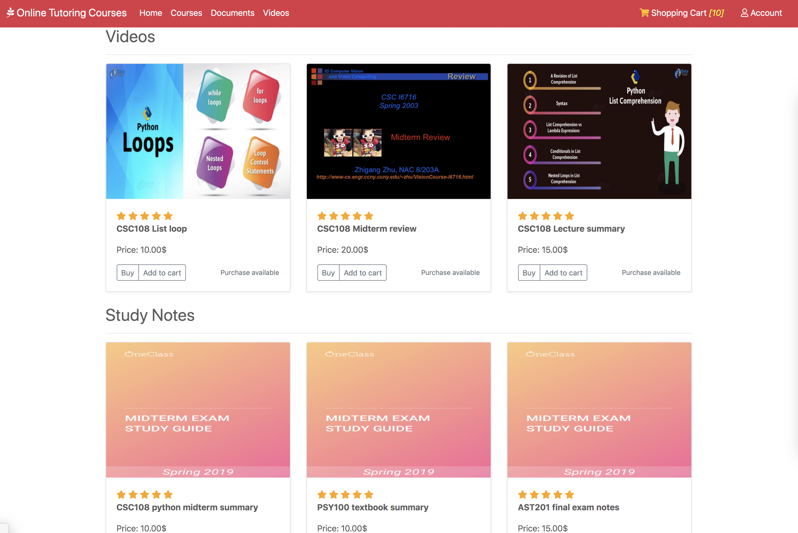

# full-stack-javascript

An online tutorial web app that allows students to buy tutorial courses, tutorial videos and study notes, using RESTApi.

Features:
Display all the online courses/videos/study notes
Allow users to add/remove items to shopping cart
Allow users to add/remove their orders.
User account

Front-end: HTML/CSS, bootstrap, responsive.
Backend: Express,router 
Database: MongoDB (Mongoose)

